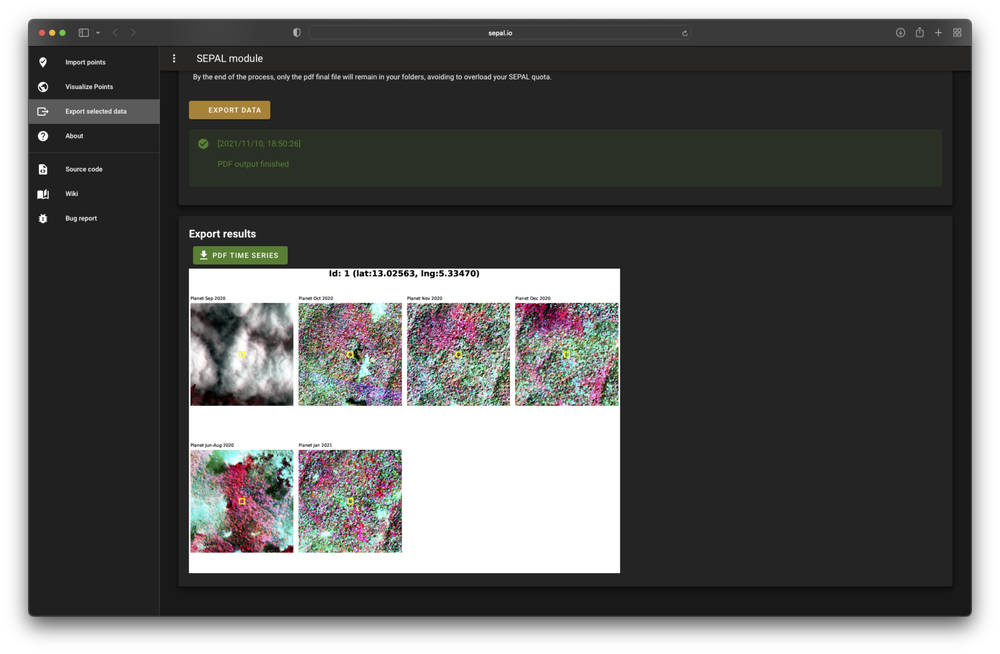

# Clip time series

[](./LICENSE)
[](https://github.com/psf/black) 

## About 

This module allows the user to download as a .pdf an auto generated time series from 2005 to 2020. 
Each year will be represented in a square of 2x2km around the point of interest using the band combination selected by the user. 

The input can be a table file discribing points or a shapefile using geometries. 

Colors are stretched using [histogram equalization](https://en.wikipedia.org/wiki/Histogram_equalization).

To produce this image the software will use the most recent satellite with a cloudless mosaic using the following priority order :

- Sentinel 2
- Landsat 8
- landsat 5
- landsat 7

The user can manually swithc of the usage of sentinel or landsat data. 

The user can replace these satellites wih PlanetLab NICFI mosaics if it has register to the NICFI programm (free). Please follow thins [link](https://docs.sepal.io/en/latest/setup/nicfi.html) for more information.



for more information about usage please read the [documentation](https://docs.sepal.io/en/latest/modules/dwn/clip-time-series.html)

## contribute

to install the project on your SEPAL account 
```
$ git clone https://github.com/openforis/clip-time-series.git
```

please retreive the develop branch where all our development live
```
$ git checkout --track origin/develop
```

please follow the contributing [guidelines](CONTRIBUTING.md).
