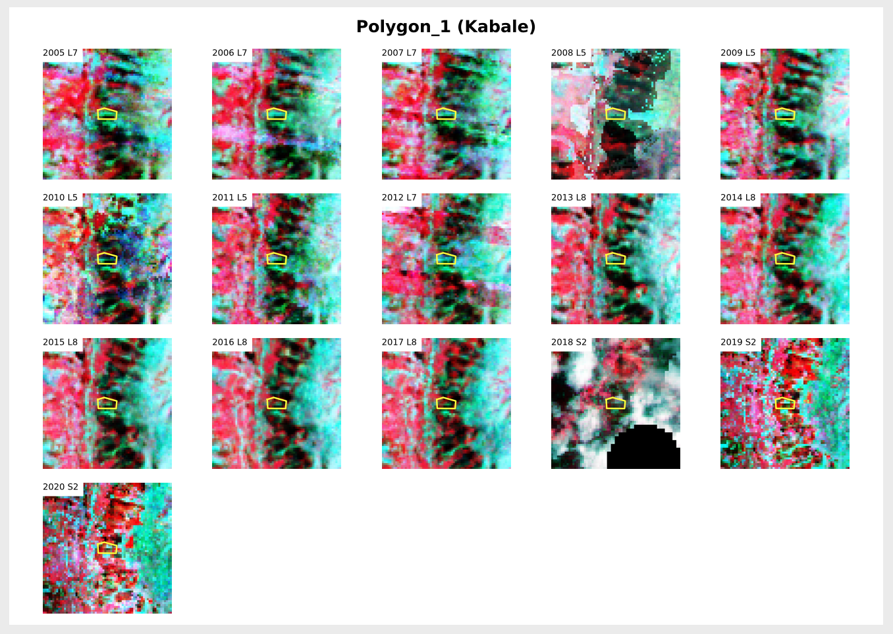

# clip-time-series-polygons

hard copy of [12rambau/clip-time-series-polygon](https://github.com/12rambau/clip-time-series-polygons) until it's added to the module

create a clip time series for a list of polygons.
Each clip will be a square of a minimum 2km of side surounding the given polygon.
The user will be able to choose the band combo, the initial shapes, and the color he wants to use to display the polygon (red would be unfortunate in Nir, red, Green for example).

> :warning: Note that to use this script you need to be connected to your own google account. You'll get an error if you try to launch it from the Google account of SEPAL.




## Usage

first download the repository to your own sepal account 

```
git clone https://github.com/12rambau/clip-time-series-polygons.git
```

In the `clip-time-series-polygons` folder, copy paste the `parameters.py.dist` file and remove the `.dist` extention 

```
cp parameters.py.dist parameters.py
```

You'll need to change the values of the parameters according to your needs. 
- **polygon_file**: name of the file containing the polygon list
- **bands_combo**: bands combo you want to display (the available list of combo is written in the parameters file)
- **nb_squares**: number of squares to display on the map to verify their size and shape
- **polygon_color**: the color which will be used for the display of the polygon
- **polygon_width**: the width that will be used for the display of the polygon
- **test_mode**: set if you're in test mode where you will only take into account the first 2 polygons of your list
- **start_year**: the starting year of the time serie
- **square_size**: the size of the minimum square around the polygon in km

Then in the `clip-time-series-polygons` folder, launch the `clip.ipynb` notebook and run its cells. 
